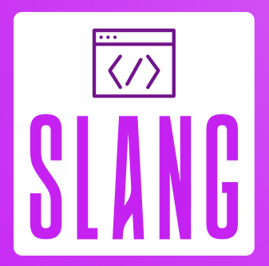

<p align="center">



<p align="center">A simple toy programming language made just for fun.<p>

</p>

## 📚 Resources

These articles/videos/books helped me a lot during the building of my own
interpreter.

- [crafting interpreter](https://craftinginterpreters.com) by Robert Nystrom
- [https://compilers.iecc.com/crenshaw/](https://compilers.iecc.com/crenshaw/)
- [@tylerlaceby youtube channel](https://www.youtube.com/@tylerlaceby)

## Run on REPL

> NOTE: You must install [Bun](https://bun.sh/) runtime on your machine to make
> it work.

```bash
./slang # this will get you into repl
```

## Examples

You can run example codes that are inside `./examples` directory.

```bash
./slang ./examples/<source_file>
```

[donut.c](https://www.a1k0n.net/2011/07/20/donut-math.html) in slang :)

```bash
./slang ./examples/donut.slang
```

Factorial

```bash
./slang ./examples/factorial.slang
```
